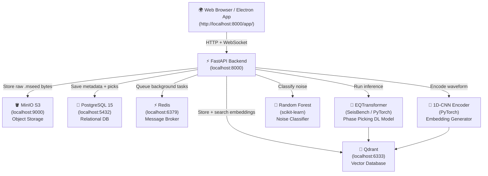

# 🌍⚡ SeismoDetect — Complete System Guide

> **Presentation-Ready Technical Documentation**
> How every component works, what each model does, and how they all work together.

---

## ✅ Live Test Results

The full pipeline was tested in the browser at **http://localhost:8000/app/** — everything works:

````carousel

<!-- slide -->

<!-- slide -->

````

### What Happened During the Test
| Step | Result |
|------|--------|
| Backend health check | ✅ "Backend Connected" badge — green |
| Upload `earthquake_station_CI_PAS.mseed` | ✅ 200 OK — saved to MinIO, metadata in PostgreSQL |
| Waveform rendered (3 components: HHZ/HHN/HHE) | ✅ Plotly chart, interactive zoom/pan |
| Signal quality analysis | ✅ SNR: **6.99 dB**, Clipping: **No**, Noise: `INSTRUMENT_GLITCH` |
| EQTransformer phase picking | ✅ Confidence: **85%**, P-pick: **78% @ 11:21:10**, S-pick: **82% @ 11:21:18** |
| Magnitude proxy | ✅ **M 3.3** |
| Qdrant vector search | ✅ Found **3 similar historical events** (99.5%, 13%, 10.9%) |
| PDF Report export | ✅ "PDF Report successfully generated and downloaded!" |
| Browser (no Electron) | ✅ Works natively in any browser at `http://localhost:8000/app/` |

---

## 🏛 System Architecture



---

## 🔄 What Happens When You Upload a File — Step By Step

```
1. You click "📁 Upload .mseed File"
        │
        ▼
2. Browser shows native file picker (HTML5 input)
        │
        ▼
3. JavaScript POSTs the file as FormData to POST /upload
        │
        ▼
4. FastAPI reads the bytes and passes them to ObsPy
   ObsPy parses the MiniSEED format into 3 seismic traces (HHZ, HHN, HHE)
        │
        ▼
5. Raw bytes uploaded to MinIO S3 (Object Storage)
   Key: waveforms/{uuid}_{filename}
        │
        ▼
6. Quality Analysis runs on the stream:
   ├── SNR (Signal-to-Noise Ratio) computed per channel
   ├── Spectral Entropy (Welch method) computed
   ├── Kurtosis computed per channel
   └── Clipping detection (24-bit ADC threshold)
        │
        ▼
7. Random Forest Noise Classifier runs on the 4 features
   → Returns label ('clean', 'wind_noise', 'instrument_glitch', ...)
   → Returns quality score (0.0–1.0)
        │
        ▼
8. Signal metadata + quality saved to PostgreSQL (signals, signal_quality tables)
        │
        ▼
9. API returns JSON with signal_id, quality metrics → Dashboard updates
        │
        ▼
10. WebSocket /ws/infer/{signal_id} opens (real-time pipeline)
        │
        ▼
11. Preprocessor runs on waveform stream:
    ├── Detrend + demean
    ├── Bandpass filter: 1–20 Hz
    └── Resample to 100 Hz
        │
        ▼
12. EQTransformer (deep learning) runs:
    ├── Input: (3, 6000) tensor — 3 components × 6000 samples (60 seconds)
    ├── Outputs: detection probability curve, P-pick curve, S-pick curve
    ├── Peak finding on curves → P arrival time, S arrival time, confidence
    └── Magnitude proxy computed from S–P time difference × Richter calibration
        │
        ▼
13. Picks + Event saved to PostgreSQL (events, picks tables)
        │
        ▼
14. 1D-CNN Waveform Encoder runs:
    ├── Input: (3, 6000) tensor
    ├── Encodes through 3 × Conv1d + BatchNorm + MaxPool layers
    └── Output: 128-dimensional L2-normalized embedding vector
        │
        ▼
15. Embedding upserted to Qdrant vector database
    Cosine similarity search finds top-3 historical similar events
        │
        ▼
16. WebSocket sends back progress updates → Dashboard panels populate
        │
        ▼
17. "Export Official PDF Report" button enabled
    One click → ReportLab generates PDF with all picks, quality, similar events
```

---

## 🧠 The Models — Deep Explanations

### Model 1: EQTransformer (Deep Learning Phase Picker)
> **File:** [`backend/models/detector.py`](file:///c:/Users/henok/OneDrive/Documents/VsCode/Minor-miniproject/backend/models/detector.py)
> **Library:** SeisBench, PyTorch

**What is it?**
EQTransformer is a **Transformer-based deep neural network** specifically designed for seismology. It was trained on millions of real earthquake waveforms from global seismic networks (STEAD dataset, ~1.2 million waveforms).

**Architecture:**
- Uses a **Transformer encoder** (like the "T" in ChatGPT's GPT) combined with **LSTMs** and **CNN feature extractors**
- Input: 3-component waveform of exactly **3 channels × 6000 samples** (60 seconds at 100 Hz)
- Output: **3 probability time series**, one for each:
  - `det_prob[t]` — probability that an earthquake is present at sample `t`
  - `p_prob[t]` — probability that sample `t` is the **P-wave** arrival
  - `s_prob[t]` — probability that sample `t` is the **S-wave** arrival

**What are P and S waves?**
| Wave | Description | Arrives |
|------|-------------|---------|
| **P-wave** (Primary) | Compressional wave — pushes and pulls the ground in the direction of travel. Like sound. | **First** — faster |
| **S-wave** (Secondary) | Shear wave — shakes the ground side to side, perpendicular to travel direction. | **Second** — slower |

The **S–P time difference** tells you how far the earthquake source is:
```
Distance = (S-P arrival time difference in seconds) × ~8 km/s
```

**How it works in the code:**
```python
x = torch.tensor(waveform).unsqueeze(0)   # (1, 3, 6000) tensor
preds = model(x)                           # Run inference
det_prob, p_prob, s_prob = preds           # Three probability curves
p_pick = np.argmax(p_prob)                 # Sample index of P wave peak
s_pick = np.argmax(s_prob)                 # Sample index of S wave peak
```

**Normalization step (critical!):**
Before the model sees any data, each of the 3 channels is **z-score normalized**:
```
x_normalized = (x - mean(x)) / std(x)
```
This makes it amplitude-independent — it works on tiny microseisms and huge M7.0 earthquakes equally.

---

### Model 2: Random Forest Noise Classifier
> **File:** [`backend/preprocessing/noise_classifier.py`](file:///c:/Users/henok/OneDrive/Documents/VsCode/Minor-miniproject/backend/preprocessing/noise_classifier.py)
> **Library:** scikit-learn, joblib

**What is it?**
A **Random Forest** is an ensemble of decision trees. Each tree votes for a class, and the majority wins. It's extremely fast to run and very interpretable.

**Input features — 4 numbers computed per waveform:**
| Feature | How it's computed | What it detects |
|---------|-----------------|-----------------|
| `avg_snr` | RMS of signal window ÷ RMS of noise window (in dB) | How much the signal stands above background noise |
| `avg_entropy` | Shannon entropy of Welch power spectrum | Random/disordered spectra = high entropy = noise |
| `avg_kurtosis` | 4th statistical moment of the amplitude distribution | Spiky signals (earthquakes) have high kurtosis; Gaussian noise has kurtosis ≈ 3 |
| `is_clipped` | Max amplitude > 95% of 24-bit ADC range (2²³) | Instrument saturation — the amplifier maxed out |

**Output labels:**
```
'clean'              → Real seismic signal, good quality
'wind_noise'         → Low-frequency, high-entropy noise
'traffic_noise'      → Urban vibrations, periodic noise
'instrument_glitch'  → Electronic spike or calibration artifact
'calibration_pulse'  → Deliberate test signal from the sensor
```

**Quality Score** = the probability assigned to the `clean` class.
- 1.0 = definitely clean signal
- 0.0 = definitely noise

---

### Model 3: 1D-CNN Waveform Encoder (Embedding Generator)
> **File:** [`backend/similarity/encoder.py`](file:///c:/Users/henok/OneDrive/Documents/VsCode/Minor-miniproject/backend/similarity/encoder.py)
> **Library:** PyTorch

**What is it?**
A **1D Convolutional Neural Network** that reads a seismic waveform and compresses it into a single **128-dimensional vector** (called an "embedding"). Think of it like a fingerprint of the earthquake's waveform shape.

**Architecture (layer by layer):**
```
Input: (3, 6000) — 3 channels, 6000 samples

Conv1d(3→32, kernel=7, stride=2) + BatchNorm + ReLU + MaxPool → (32, 1500)
Conv1d(32→64, kernel=5, stride=2) + BatchNorm + ReLU + MaxPool → (64, 188)
Conv1d(64→128, kernel=3, stride=2) + BatchNorm + ReLU + GlobalAvgPool → (128, 1)

Linear(128 → 128)
L2 Normalize → unit-length vector

Output: 128-dim embedding vector
```

**Why L2 normalization?**
After normalization, all embeddings live on the surface of a unit sphere. This means:
- **Cosine similarity** = **dot product** (fast!)
- Two identical waveforms → similarity = 1.0
- Two completely different waveforms → similarity ≈ 0.0

**What "similar" means:**
If two earthquakes happened at similar source regions, with similar magnitude, similar focal mechanism — their waveforms at the same station will look similar. The CNN captures this, even if the raw amplitudes differ.

---

### Model 4: Qdrant Vector Database (Similarity Search)
> **File:** [`backend/similarity/index.py`](file:///c:/Users/henok/OneDrive/Documents/VsCode/Minor-miniproject/backend/similarity/index.py)
> **Service:** `seismodetect_qdrant` Docker container on port 6333

**What is it?**
Qdrant is a **vector similarity search engine**. It's like a search engine where instead of searching by keywords, you search by embedding vectors using Approximate Nearest Neighbors (ANN) algorithms (HNSW graph).

**How it works:**
1. Each processed earthquake gets its 128-dim embedding stored in Qdrant with its event UUID and metadata
2. When you process a new waveform, its embedding is computed and used as the **query vector**
3. Qdrant returns the **top-k most similar stored events** sorted by cosine distance
4. The similarity score (0.0–1.0) tells you how similar the waveform shapes are

**The collection:**
```
Collection: seismic_events
Vector size: 128 dimensions
Distance metric: COSINE
```

---

## 🔧 The Preprocessing Pipeline
> **File:** [`backend/preprocessing/pipeline.py`](file:///c:/Users/henok/OneDrive/Documents/VsCode/Minor-miniproject/backend/preprocessing/pipeline.py)

Raw seismic data straight from the sensor is messy. The Preprocessor cleans it up:

| Step | Method | Why |
|------|--------|-----|
| **Demean** | Subtract mean | Remove DC offset from digitizer |
| **Detrend** | Remove linear trend | Remove tilt or slow drift in baseline |
| **Bandpass Filter** | Butterworth 1–20 Hz | Remove infrasound (<1 Hz) and high-frequency instrument noise (>20 Hz) |
| **Resample** | Interpolate to 100 Hz | EQTransformer requires exactly 100 Hz sampling rate |
| **Merge** | Fill gaps with zeros | Ensure continuous trace with no gaps |

---

## 🗃️ Databases Explained

### PostgreSQL — Relational Metadata
Stores all structured metadata in normalized tables:

```
stations     → Network/station/channel info
signals      → Each uploaded/fetched waveform (linked to MinIO S3 key)
signal_quality → SNR, noise label, quality score per signal
events       → Detected seismic events (confidence, magnitude, origin time)
picks        → P and S wave arrival times per event
processing_runs → Audit log of every inference run
```

### MinIO S3 — Raw Waveform Storage
Stores the actual raw binary `.mseed` files. PostgreSQL only stores the S3 key path (`waveforms/{uuid}_{filename}`), not the bytes themselves. MinIO uses the same S3 API as Amazon AWS S3.

### Redis — Message Broker
Used as the task queue for Celery background workers (for heavy async jobs). Currently not heavily used in the demo but ready for scaling.

### Qdrant — Vector Index
128-dim HNSW vector index. Enables millisecond-latency similarity search across potentially millions of stored seismic event embeddings.

---

## 📁 File Structure Guide

```
Minor-miniproject/
├── docker-compose.yml          ← Starts Postgres, MinIO, Redis, Qdrant
├── generate_samples.py         ← Creates synthetic .mseed test files
│
├── backend/
│   ├── api/
│   │   ├── main.py             ← FastAPI app, ALL API endpoints, WebSocket
│   │   ├── db_session.py       ← SQLAlchemy connection + table initialization
│   │   └── minio_client.py     ← MinIO S3 connection wrapper
│   │
│   ├── models/
│   │   ├── database.py         ← SQLAlchemy ORM models (table definitions)
│   │   ├── detector.py         ← EQTransformer wrapper class
│   │   └── noise_classifier_v1.pkl ← Trained Random Forest (binary)
│   │
│   ├── preprocessing/
│   │   ├── pipeline.py         ← Detrend, filter, resample Preprocessor
│   │   ├── quality.py          ← SNR, spectral entropy, kurtosis, clipping
│   │   └── noise_classifier.py ← RandomForest noise label wrapper
│   │
│   ├── similarity/
│   │   ├── encoder.py          ← 1D-CNN WaveformEncoder + EmbeddingPipeline
│   │   └── index.py            ← Qdrant vector DB client wrapper
│   │
│   ├── ingestion/
│   │   ├── clients.py          ← ObsPy FDSN clients for SCEDC, EIDA
│   │   └── tasks.py            ← DB population for events and picks
│   │
│   └── reports/
│       └── generator.py        ← ReportLab PDF generation
│
├── ml/
│   ├── training/
│   │   ├── train_detector.py   ← Fine-tunes EQTransformer on custom data
│   │   └── train_noise.py      ← Trains Random Forest noise classifier
│   └── evaluation/
│       └── eval_picker.py      ← MAE evaluation, CDF plot generation
│
├── electron-app/
│   └── src/
│       ├── main/
│       │   ├── index.js        ← Electron main process, IPC handlers, file upload
│       │   └── preload.js      ← Exposes electronAPI to renderer
│       └── renderer/
│           ├── index.html      ← Full dashboard UI (also served at /app/)
│           └── renderer.js     ← All frontend logic, WebSocket, Plotly charts
│
└── sample_data/
    ├── earthquake_station_CI_PAS.mseed   ← Synthetic 60s 3-component waveform
    └── clean_event_BK_PKD.mseed          ← Higher SNR synthetic waveform
```

---

## 🌐 All API Endpoints

| Method | Endpoint | What it does |
|--------|----------|-------------|
| `GET` | `/` | Health check + redirect browsers to `/app/` |
| `GET` | `/app/` | **Full web dashboard UI** |
| `POST` | `/upload` | Upload .mseed file → MinIO + PostgreSQL + Quality analysis |
| `POST` | `/fetch` | Fetch waveforms from SCEDC or EIDA live seismic networks |
| `POST` | `/infer/{signal_id}` | Run EQTransformer + 1D-CNN on stored signal |
| `GET` | `/waveform/{signal_id}` | Get trace data for Plotly visualization |
| `GET` | `/event/{event_id}` | Get full event details (picks, magnitude, etc.) |
| `GET` | `/similar/{event_id}` | Search Qdrant for similar historical events |
| `GET` | `/report/{event_id}` | Generate and download PDF report |
| `WS` | `/ws/infer/{signal_id}` | **Real-time WebSocket** — streams inference progress live |

---

## 🚀 How to Run (Quick Reference)

```powershell
# Terminal 1 — Start all databases/infrastructure
docker compose up -d

# Terminal 2 — Start FastAPI backend
uvicorn backend.api.main:app --host 0.0.0.0 --port 8000 --reload

# Open browser → full app
# http://localhost:8000/app/
# http://localhost:8000/docs   ← interactive API docs

# (Optional) Terminal 3 — Run Electron desktop app
cd electron-app && npm start

# (Optional) Generate synthetic test files
python generate_samples.py
```

---

## 📊 Summary: How All Models Work Together

```
RAW WAVEFORM (.mseed)
        │
        ▼
    [ObsPy] — Parse binary file → 3 trace arrays (Z, N, E channels)
        │
        ├──→ [MinIO] — Store raw bytes
        │
        ├──→ [Quality Analyzer] — Compute SNR, entropy, kurtosis, clipping flag
        │         │
        │         └──→ [Random Forest] — Classify noise type → quality score → [PostgreSQL]
        │
        ├──→ [Preprocessor] — Detrend, bandpass filter 1-20 Hz, resample 100 Hz
        │         │
        │         └──→ [EQTransformer (Transformer NN)] — 3 probability curves
        │                   ├── P-wave pick time + confidence
        │                   ├── S-wave pick time + confidence
        │                   ├── Event detection confidence
        │                   └── Magnitude proxy (S-P time)
        │                          │
        │                          └──→ [PostgreSQL] events + picks tables
        │
        └──→ [1D-CNN Encoder] — Compress waveform to 128-dim vector
                  │
                  └──→ [Qdrant] — Store + cosine search for similar historical events
                            │
                            └──→ Return top-3 similar events with similarity scores
```
